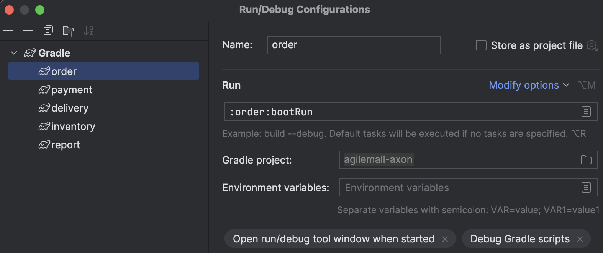
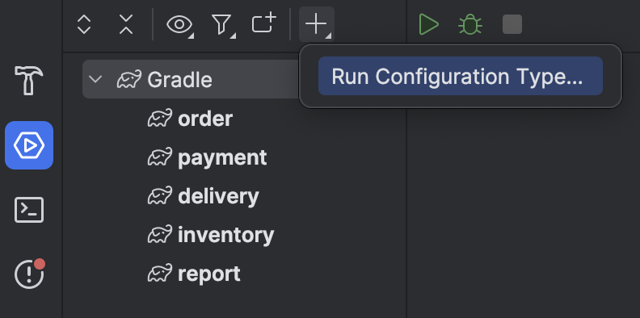

# Microservice Pattern Example using Axon framwork

source code를 보시려면  [여기](https://github.com/happykubepia/agilemall-axon.git)를 누르세요. 

## 사전준비
- IntelliJ 설치: multi module and gradle project를 만들기 위해서 IntelliJ 필요
  - 무료버전인 IntelliJ CE설치: https://www.jetbrains.com/idea/download

- Docker설치
  - Mac:
    - brew install docker
    - open -a docker
  - Window: https://happycloud-lee.tistory.com/14

- MySQL설치
  - 설치
  ```
  % docker run -d --rm --name mysql -p 3306:3306 -e MYSQL_ROOT_PASSWORD=P@ssw0rd$ -v ~/data/mysql:/var/lib/mysql mysql
  ```
  
  - DBeaver에서 연결: 'Driver properties'탭에서 'allowPublicKeyRetrieval'을 'true'로 변경해야 함

- Axon Server 설치
  - 설치
```  
docker run -d --rm --name axonserver -p 18024:8024 -p 18124:8124 -e axoniq.axonserver.devmode.enabled=true axoniq/axonserver
```
  - Web console접근: http://localhost:18024

- IntelliJ 설정
  - Lombok 사용
    - Annotation Processing 활성화: Settings > Build, Execution, Deployment > Compiler > Annotation Processors
    - Plugin 설치: Settings > Plugin 선택 후 'Market place'에서 'Lombok'검색하여 설치
  - 오타 체크 비활성화: Settings > Editor > Inspections 클릭 후 'Typo'로 검색하여 모두 Uncheck

----

## 어플리케이션 import 및 테스트 
- Import application 
  - 작업 디렉토리 생성: 홈 디렉토리 밑에 적절한 작업 디렉토리 생성
  - 소스 다운로드
  ```
  > git clone https://github.com/happykubepia/agilemall-axon.git
  > cd agilemall-axon
  ```
  - IntelliJ 시작 후 'File > Open...'실행하여 import

- Run/Debug Configurations
  - 메인 메뉴 'Run > Run/Debug Configurations' 실행
  - 좌측 상단 '+'버튼 클릭 후 'Gradle'선택
  - 아래 그림과 같이 셋팅하여 5개 서비스 추가
  

- 실행
  - 좌측 하단의 '서비스' 아이콘 클릭 후 아래 그림 처럼 Gradle 서비스 나타나게 함
  
  - 각 서비스를 모두 실행 시킴
 
- 테스트
  - 제품 정보 등록
    - 브라우저에서 swagger page 오픈: http://localhost:18081/swagger-ui/index.html 
    - 제품 등록: 아래 예제 처럼 적절하게 제품 정보를 등록함
        ```
        {
          "productId": "PROD_10041",
          "productName": "Apple",
          "unitPrice": 1000,
          "inventoryQty": 100000
        }
        ```
    - 주문 생성/수정/삭제 테스트 페이지 접근: http://localhost:18081/swagger-ui/index.html 
    - 주문 생성 테스트: 등록한 제품코드를 일치 시키고 나머지는 적절히 변경하여 테스트  
      
        ```
        {
          "userId": "hiondal",
          "orderReqDetails": [
            {
              "productId": "PROD_10041",
              "qty": 10
            },
            {
              "productId": "PROD_10042",
              "qty": 5
            },
            {
              "productId": "PROD_10043",
              "qty": 15
            }
          ],
          "paymentReqDetails": [
            {
              "paymentKind": "10",
              "paymentRate": 0.9
            },
            {
              "paymentKind": "20",
              "paymentRate": 0.1
            }
          ]
        }
        ```

    - 주문수정 테스트 
    위 주문수정 결과에서 주문ID를 복사하여 orderId값을 변경 후 수행. 
      ```
      {
      "orderId": "ORDER_469309120",
      "orderReqDetails": [
        {
          "productId": "PROD_10041",
          "qty": 1
        }
      ],
      "paymentReqDetails": [
        {
          "paymentKind": "10",
          "paymentRate": 1
        }
      ]
      }
      ```
  
    - 주문삭제 
    위 주문수정 결과에서 주문ID를 복사하여 orderId값을 변경 후 수행. 
  

----

## Trouble shooting

> Exception in thread "QueryProcessor-0" com.thoughtworks.xstream.security.ForbiddenClassException
  - 원인: Axon 4.5.x 부터 적용된 Security 정책 때문임
  - 해결책: AxonConfig를 만들고 통신을 허용할 패키지를 지정하면 됨 
  - 참고: https://discuss.axoniq.io/t/getting-xstream-dependency-exception/3634/6


> Project build 시 'Task classes not found in root project'라는 에러 발생시 
  - 'File > Invalidated Caches' 수행하여 Cache 삭제 후 재시작 하면 됨 
  - 참고) https://dlrudtn108.tistory.com/39

> 에러 발생 후 Order의 EventHandler가 실행 안될 때 
  원인: Order와 다른 서비스의 token index값이 일치 하지 않기 때문임 
  - orders, order_detail의 모든 record 삭제 
  ```
    delete  from orderDB.order_detail;
    delete from orderDB.orders;
    delete  from paymentDB.payment_detail;
    delete  from paymentDB.payment;
    delete  from deliveryDB.shipping;
    delete from reportDB.report;
  ```
  - Token Global index 초기화 
    - Axon server UI에서 [Reset Event Store] 클릭하여 token 초기화
    - 각 DB의 token_entry 테이블의 데이터 삭제
    ```
    delete from orderDB.token_entry;
    delete from paymentDB.token_entry;
    delete from deliveryDB.token_entry;
    delete from inventoryDB.token_entry;
    ``` 

> 에러 발생 후 Saga transaction이 모두 실행 되었는데 Payment, Delivery의 Event handler가 실행 안될 때 
  - 원인: Order와 다른 서비스의 token index값이 일치 하지 않기 때문임 
  - 각 DB의 token_entry 테이블의 데이터 삭제. 삭제 하면 자동으로 Last token index값으로 일치 시킴
    ```
    delete from orderDB.token_entry;
    delete from paymentDB.token_entry;
    delete from deliveryDB.token_entry;
    delete from inventoryDB.token_entry;
    ```
  - Token값 확인 
  ```
  select cast(token as char) from orderDB.token_entry;
  select cast(token as char) from paymentDB.token_entry;
  select cast(token as char) from deliveryDB.token_entry;
  select cast(token as char) from inventoryDB.token_entry;
  ```

> AXONIQ-2000 에러
Error occurred during store batch operation: 
io.axoniq.axonserver.exception.MessagingPlatformException: [AXONIQ-2000] Invalid sequence number 0 for aggregate
  - 원인1) Aggregate class의 @AggregateIdentifier로 지정한 property가 유일한 값이 아니면 발생 
    - 설명: 각 Aggregate객체는 구별할 수 있는 유일한 id가 있어야 함   
    - 조치: @AggregateIdentifier로 지정한 property는 유일한 값이 저장되도록 정확히 지정 

  - 원인2) CommandGateway, EventGateway, QueryGateway 객체가 transient로 생성되지 않은 경우 
    - 설명: transient 키워드는 해당 객체를 직렬화(저장 또는 전송을 위해 binary형식으로 변환하는 것)하지 않게하는 예약 키워드임. 
     전송 시 binary형식으로 변환하지 않아야 하기 때문에 반드시 붙여야 함
    - 예)
    @Autowired
    private transient CommandGateway commandGateway;
  
  - 원인3) Saga class에서 @Autowired로 Service class를 생성하는 경우 발생할 수 있음(정상 동작 할 수도 있음)
    - 조치: Saga class에서 개발한 class를 @Autowired로 생성하는 부분을 빼고 테스트 하고, 문제 발생 안하면 적절히 조치

> 참고
  - Build jar
    application 최상위 디렉토리에서 수행
  ```
  ./gradlew [clean] {application name}:build [--stacktrace --info --refresh-dependencies -x test]
  ex1) ./gradlew clean order:build -x test
  ex2) ./gradlew clean order:build --stacktrace --info --refresh-dependencies -x test
  ex3) ./gradlew clean order:build
  ```

  - MySQL 데이터 디렉토리 찾기 
  ```
  mysql> show variables like 'datadir';
  +---------------+-----------------+
  | Variable_name | Value           |
  +---------------+-----------------+
  | datadir       | /var/lib/mysql/ |
  +---------------+---------------
  ```

  - JPA 참고: https://exhibitlove.tistory.com/262
    
  - 로그 패턴 조정하기  
  application.properties에 아래 예제와 같이 추가함
  ```
  # Logging
  logging.level.com.agilemall=info
  logging.level.org.axonframework=info
  logging.pattern.console=%clr(%d{MM/dd HH:mm:ss}){faint} %clr(${LOG_LEVEL_PATTERN:-%5p}){magenta} %clr(---){faint} %clr(%-40.40logger{39}){cyan} %clr(%m%n${LOG_EXCEPTION_CONVERSION_WORD:%wEx}){faint}   
  ```
  기본 log pattern은 아래와 같음. 
  ```
  "%clr(%d{yyyy-MM-dd HH:mm:ss.SSS}){faint} "
  + "%clr(${LOG_LEVEL_PATTERN:-%5p}) %clr(${PID:- }){magenta} %clr(---){faint} "
  + "%clr([%15.15t]){faint} %clr(%-40.40logger{39}){cyan} "
  + "%clr(:){faint} %m%n${LOG_EXCEPTION_CONVERSION_WORD:-%wEx}";
  출처: https://wonwoo.me/98 [개발블로그:티스토리]
  ```


